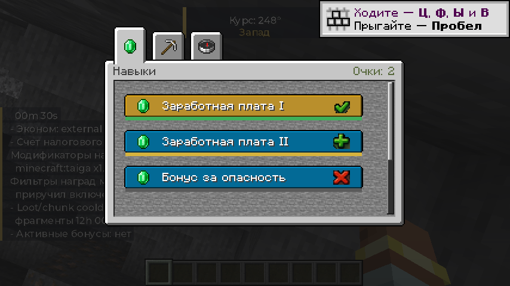
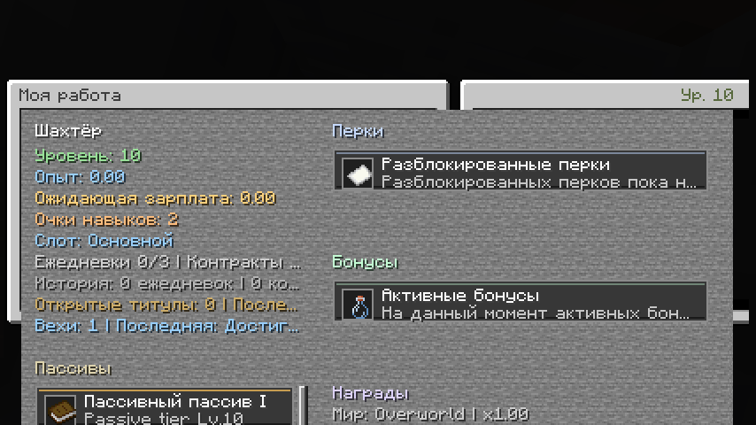
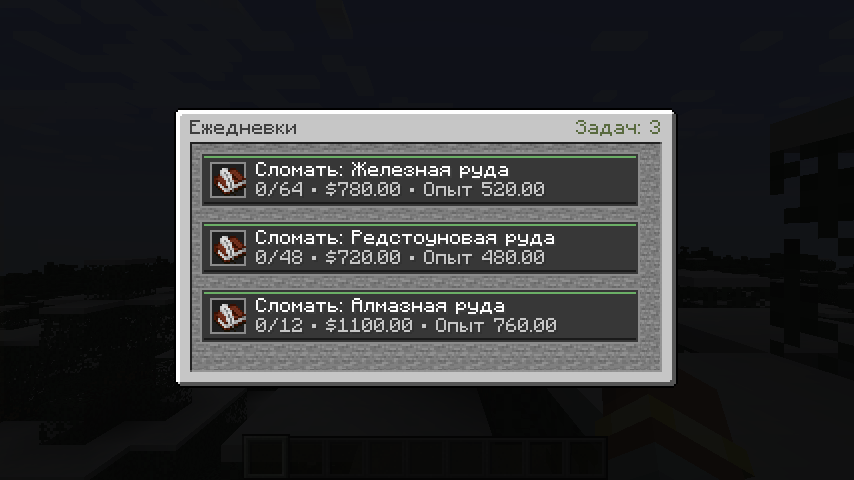
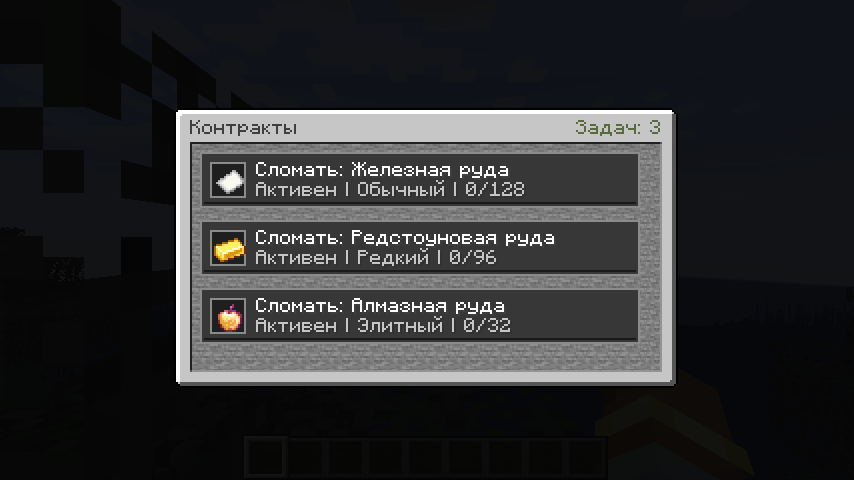
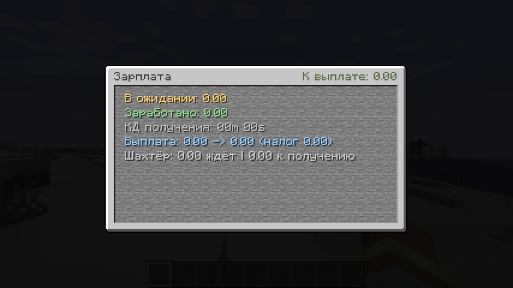
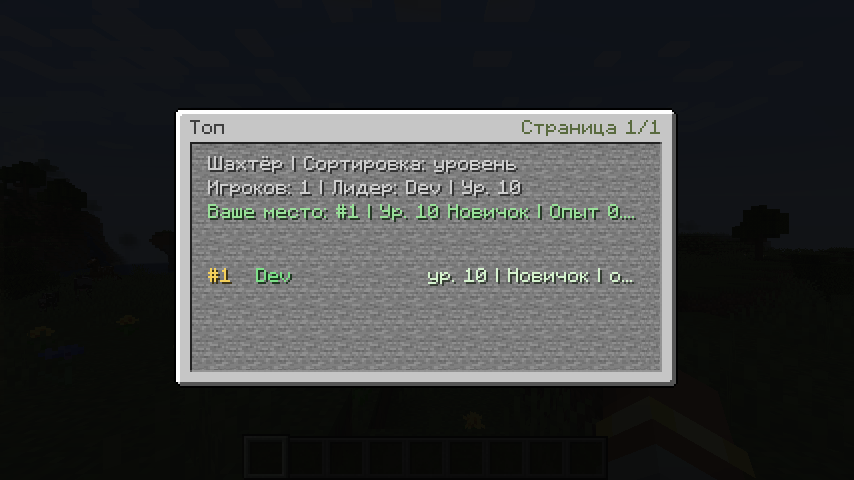

# Advanced Jobs RPG

`Advanced Jobs RPG` is a Forge `1.20.1` professions mod focused on long-term player progression:

- primary and secondary job slots
- salary, tax, and economy routing
- skill trees and perk unlocks
- daily tasks and rotating contracts
- service-desk NPC hub
- leaderboard, milestones, and titles
- compact vanilla-style GUI
- direct support for `Z_Economy` through its public API

## Requirements

- Minecraft `1.20.1`
- Forge `47.4.18+`
- Java `17`

## Features

- configurable jobs, perks, tasks, and contracts through JSON
- player onboarding through `/jobs`, guide commands, and service NPCs
- internal economy fallback
- external economy mode through `Z_Economy`
- admin tools for hub deployment, repair, diagnostics, cache control, and anti-abuse checks
- Russian and English localization

## Screenshots

### Skills


### My Job


### Daily


### Contracts


### Salary


### Leaderboard


## Quick Start

1. Build the mod or take `build/libs/advancedjobs-1.0.5.jar`.
2. Put the jar into the server `mods` directory.
3. Start the server once so configs are generated.
4. Review `config/ZAdvancedJobs/`.
5. Restart the server after changing config files.

External economy setup:

1. Install `Z_Economy` on the same server.
2. Set `"provider": "external"` in `config/ZAdvancedJobs/economy.json`.
3. Set `"externalCurrency": "z_coin"`.

Minimal `economy.json` example:

```json
{
  "provider": "external",
  "externalCurrency": "z_coin",
  "taxSinkAccountUuid": "00000000-0000-0000-0000-000000000001"
}
```

## Build

```powershell
$env:JAVA_HOME='C:\Program Files\Eclipse Adoptium\jdk-17.0.18.8-hotspot'
$env:Path="$env:JAVA_HOME\bin;$env:Path"
.\gradlew.bat build
```

Optional client integrations:

- JEI support is compiled automatically if a nearby jar is identified as JEI through Forge mod metadata, with filename prefix matching kept as fallback
- JourneyMap support is compiled automatically if a nearby jar is identified as JourneyMap through Forge mod metadata, with filename prefix matching kept as fallback
- if these jars are absent, the core mod still builds without the optional integration classes

Output:

```text
build/libs/advancedjobs-1.0.5.jar
```

## Generated Config Files

After first start the mod generates:

- `config/ZAdvancedJobs/common.json`
- `config/ZAdvancedJobs/jobs.json`
- `config/ZAdvancedJobs/perks.json`
- `config/ZAdvancedJobs/daily_tasks.json`
- `config/ZAdvancedJobs/contracts.json`
- `config/ZAdvancedJobs/economy.json`
- `config/ZAdvancedJobs/client.json`
- `config/ZAdvancedJobs/npc_skins.json`
- `config/ZAdvancedJobs/npc_labels.json`

## Main Commands

Player:

- `/jobs`
- `/jobs info`
- `/jobs help`
- `/jobs salary`
- `/jobs daily`
- `/jobs contracts`
- `/jobs skills`
- `/jobs top`
- `/jobs where ...`
- `/jobs guide ...`
- `/jobs navigate ...`

Admin:

- `/jobsadmin help`
- `/jobsadmin reload`
- `/jobsadmin status`
- `/jobsadmin spawnhub`
- `/jobsadmin repairhub`
- `/jobsadmin doctor`
- `/jobsadmin doctorfix`
- `/jobsadmin normalizehub`
- `/jobsadmin alignhub`
- `/jobsadmin hardenhub`
- `/jobsadmin unlockskill <player> <job> <node>`

Full reference:

- [docs/COMMANDS.md](docs/COMMANDS.md)

## Documentation

- [docs/INSTALLATION.md](docs/INSTALLATION.md)
- [docs/CONFIGURATION.md](docs/CONFIGURATION.md)
- [docs/COMMANDS.md](docs/COMMANDS.md)
- [docs/INTEGRATION_ZECONOMY.md](docs/INTEGRATION_ZECONOMY.md)
- [docs/UI.md](docs/UI.md)
- [UI_STYLE_NOTES.md](UI_STYLE_NOTES.md)
- [VANILLA_UI_TEXTURES.md](VANILLA_UI_TEXTURES.md)
- [CHANGELOG.md](CHANGELOG.md)
- [CONTRIBUTING.md](CONTRIBUTING.md)
- [LICENSE](LICENSE)

## Z_Economy Integration

`Advanced Jobs` uses the public `Z_Economy` API in external economy mode.

- bridge: `src/main/java/com/example/advancedjobs/economy/ExternalEconomyBridge.java`
- default external currency: `z_coin`

More details:

- [docs/INTEGRATION_ZECONOMY.md](docs/INTEGRATION_ZECONOMY.md)
